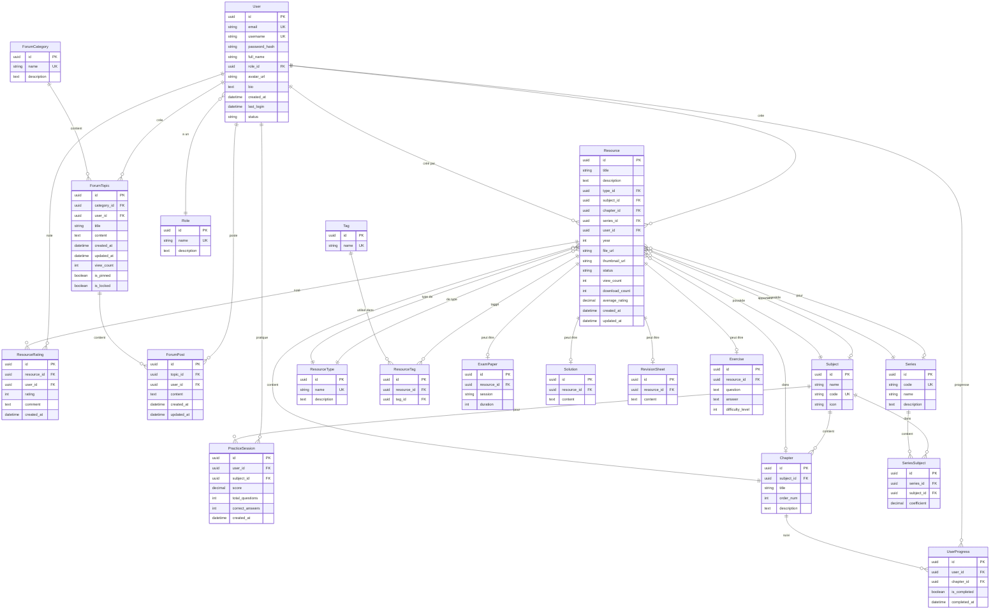

# Schéma de Base de Données - Wiki BAC BJ

## Diagramme ER (Entity-Relationship)

## Structure de la Base de Données

### 🔐 Gestion des Utilisateurs
- **User** : Utilisateurs de la plateforme
- **Role** : Rôles/permissions des utilisateurs

### 📚 Structure Académique
- **Subject** : Matières (Math, Physique, etc.)
- **Chapter** : Chapitres dans chaque matière
- **Series** : Séries du BAC (A, C, D, etc.)
- **SeriesSubject** : Table de liaison entre séries et matières (avec coefficient)

### 📄 Gestion des Ressources
- **Resource** : Ressource centrale (peut être exam, solution, exercice, etc.)
- **ResourceType** : Types de ressources (Examen, Corrigé, Fiche, etc.)
- **Tag** : Tags pour catégoriser les ressources
- **ResourceTag** : Table de liaison ressources-tags

### 📝 Types Spécifiques de Ressources
- **ExamPaper** : Sujets d'examens
- **Solution** : Corrigés d'examens
- **RevisionSheet** : Fiches de révision
- **Exercise** : Exercices avec questions/réponses

### ⭐ Interactions Utilisateurs
- **ResourceRating** : Notes et commentaires sur les ressources
- **UserProgress** : Suivi de progression par chapitre
- **PracticeSession** : Sessions de pratique/quiz

### 💬 Forum
- **ForumCategory** : Catégories du forum
- **ForumTopic** : Sujets de discussion
- **ForumPost** : Messages dans les discussions

## Relations Principales

### 1️⃣ Un utilisateur peut :
- Créer plusieurs ressources
- Noter plusieurs ressources
- Suivre sa progression sur plusieurs chapitres
- Participer à plusieurs sessions de pratique
- Créer et répondre dans le forum

### 2️⃣ Une matière (Subject) :
- Contient plusieurs chapitres
- Est associée à plusieurs séries (via SeriesSubject)
- Possède plusieurs ressources

### 3️⃣ Une ressource (Resource) :
- Est créée par un utilisateur
- Appartient à un type spécifique
- Peut être liée à une matière, un chapitre et/ou une série
- Peut être un examen, une solution, une fiche ou un exercice
- Peut avoir plusieurs tags et notes

### 4️⃣ Le forum :
- Organisé en catégories
- Les catégories contiennent des topics
- Les topics contiennent des posts
- Chaque topic/post est créé par un utilisateur

## Cardinalités Importantes

- **1:N** (One-to-Many) : Un sujet a plusieurs chapitres
- **N:M** (Many-to-Many) : Matières ↔ Séries (via SeriesSubject)
- **N:M** : Ressources ↔ Tags (via ResourceTag)
- **1:1** : Resource ↔ ExamPaper/Solution/RevisionSheet/Exercise

## Clés et Contraintes

- 🔑 Toutes les tables utilisent des **UUID v7** comme clés primaires
- 🔒 Contraintes d'unicité sur :
  - User: email, username
  - Subject: code
  - Series: code
  - ResourceType: name
  - Tag: name
  - ForumCategory: name
  - SeriesSubject: (series_id, subject_id)
  - ResourceTag: (resource_id, tag_id)

## Gestion des Suppressions (ON DELETE)

- **CASCADE** : La suppression est propagée (ex: suppression d'un user supprime ses resources)
- **SET NULL** : La clé étrangère est mise à NULL (ex: suppression d'un subject n'efface pas les resources)
