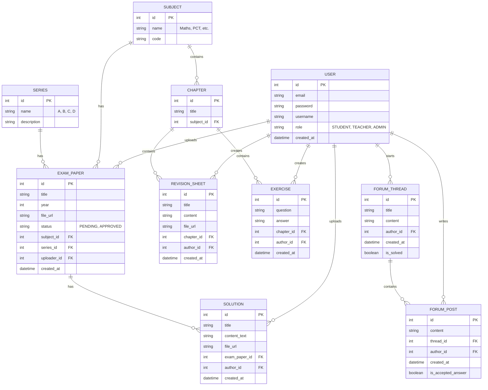

# Database Schema Design - Wiki-BAC-BJ

Based on the requirements in `README.md`, here is the proposed database schema.

## Entity-Relationship Diagram

## Table Descriptions

### Core Data
- **USER**: Stores all registered users (Students, Teachers, Admins).
- **SUBJECT**: School subjects (e.g., Mathematics, Physics, Philosophy).
- **SERIES**: BAC Series (e.g., A1, A2, B, C, D).
- **CHAPTER**: Specific chapters within a subject to categorize revisions and exercises.

### Resources
- **EXAM_PAPER (Epreuves)**: The core resource. Linked to a Subject, Series, and Year. Has a status for moderation.
- **SOLUTION (Corrigés)**: Solutions linked to a specific Exam Paper. Can be text or a file.
- **REVISION_SHEET (Fiches)**: Educational content linked to a specific Chapter.
- **EXERCISE**: Practice questions linked to a Chapter.

### Community
- **FORUM_THREAD**: Discussion topics created by users.
- **FORUM_POST**: Replies to threads.
